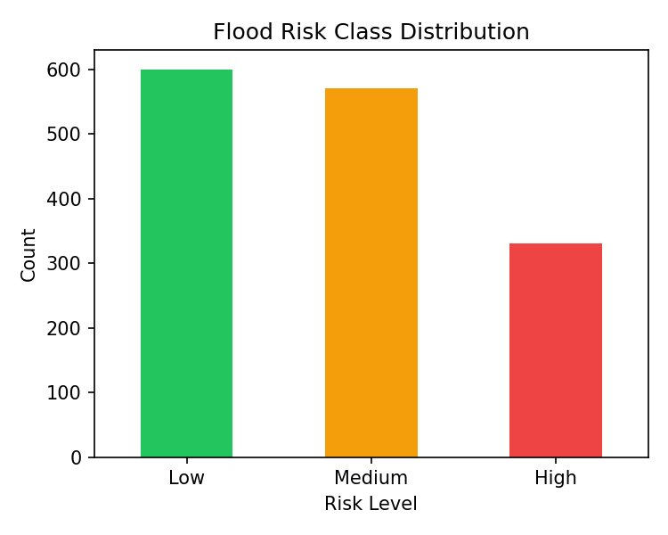
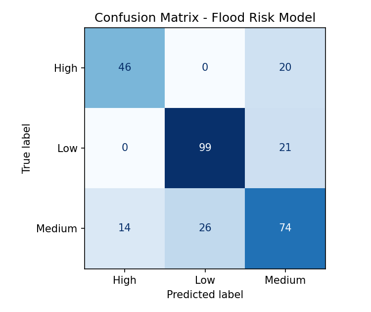
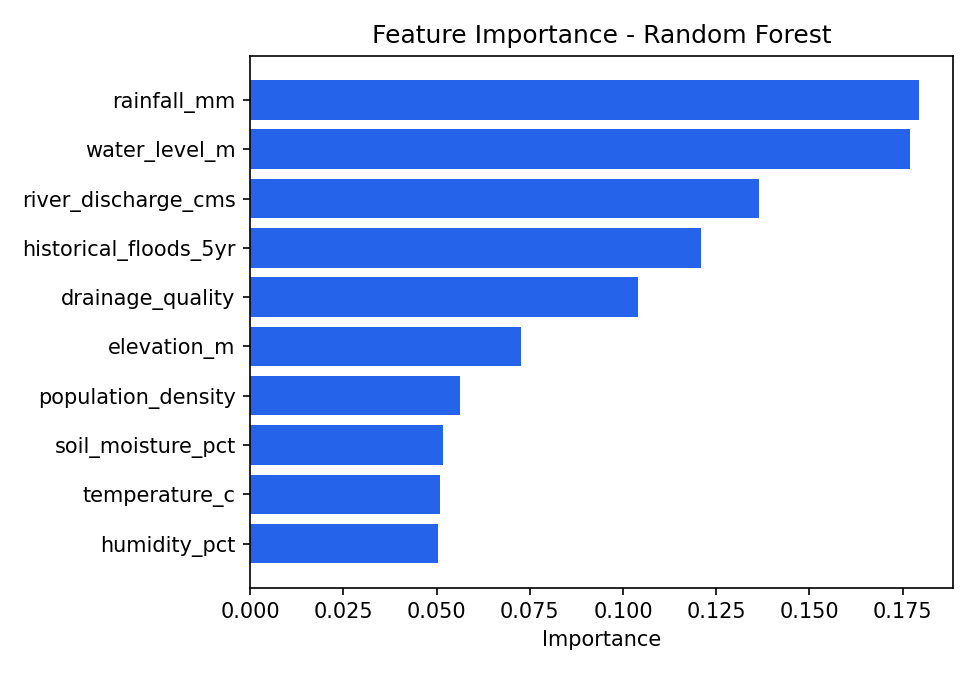

# 🌊 Flood Risk Prediction

A machine learning web app that classifies flood risk (**Low / Medium / High**) from
rainfall, river, and terrain readings, using a Random Forest model served through a
Flask web interface.



**🔴 [Live demo — runs entirely on GitHub Pages](https://harviesharma05-tech.github.io/flood-risk-prediction/)**
(no server — the trained model runs client-side in JavaScript)

---

## 📖 Project Overview

Flooding is driven by a combination of factors — rainfall, river water level,
discharge, soil saturation, drainage quality, and terrain — that are hard to reason
about by eye. This project trains a classifier on those factors and wraps it in a
simple web form so a user can enter current readings and get an instant risk
classification with a confidence score.

> **Note:** the dataset used here (`dataset/flood_data.csv`) is **synthetically
> generated** to resemble realistic flood-driver relationships, since public
> region-specific flood sensor data is hard to source. The pipeline, model, and app
> are fully functional — swap in a real dataset with the same column names and it
> works unchanged.

## ✨ Features

- Flood risk prediction (Low / Medium / High) from 10 input readings
- Confidence score + full class-probability breakdown per prediction
- Exploratory data analysis notebook (distributions, correlations)
- Model evaluation notebook (accuracy, classification report, confusion matrix)
- Feature importance graph
- Clean, dark, minimal web interface
- Printable / exportable prediction report (browser print-to-PDF)

## 📂 Project Structure

```text
Flood-Risk-Prediction/
│
├── dataset/
│   └── flood_data.csv          # synthetic flood readings + risk_level label
│
├── notebooks/
│   ├── data_analysis.ipynb     # EDA: distributions, correlations, class balance
│   └── model_training.ipynb    # training, evaluation, exports the .pkl
│
├── models/
│   ├── flood_model.pkl         # trained RandomForest + label encoder bundle
│   └── metrics.txt             # accuracy + classification report
│
├── app/
│   ├── app.py                  # Flask routes
│   ├── predict.py              # loads model, runs inference
│   └── utils.py                # form parsing / validation helpers
│
├── static/
│   ├── style.css
│   └── script.js
│
├── templates/
│   ├── index.html              # input form
│   └── result.html             # prediction result page
│
├── images/
│   ├── dashboard.png
│   ├── confusion_matrix.png
│   └── feature_importance.png
│
├── docs/                        # static, client-side version (GitHub Pages)
│   ├── index.html
│   ├── style.css
│   ├── script.js
│   └── model.js                 # trained model exported to pure JS (m2cgen)
│
├── requirements.txt
├── README.md
├── LICENSE
└── .gitignore
```

## 🧠 Machine Learning Model

**Algorithm:** Random Forest Classifier (`scikit-learn`)

**Pipeline:**

```text
Dataset → Data Cleaning → Feature Engineering → Train/Test Split (80/20, stratified)
   → Random Forest (300 trees) → Evaluation → Save Model (.pkl) → Flask App → Prediction
```

**Input features:**

| Feature | Description |
|---|---|
| `rainfall_mm` | Rainfall in the last 24h (mm) |
| `water_level_m` | River water level (m) |
| `river_discharge_cms` | River discharge (m³/s) |
| `temperature_c` | Temperature (°C) |
| `humidity_pct` | Relative humidity (%) |
| `soil_moisture_pct` | Soil moisture saturation (%) |
| `elevation_m` | Elevation of the area (m) |
| `drainage_quality` | Drainage rating, 1 (poor) – 5 (excellent) |
| `historical_floods_5yr` | Number of floods in the last 5 years |
| `population_density` | People per km² |

## 📊 Results

- **Accuracy:** ~73% on a held-out test set (see `models/metrics.txt` for the full
  classification report — precision/recall/F1 per class)
- Water level, rainfall, and flood history are the strongest predictors of risk;
  drainage quality and elevation are the strongest protective factors

| Confusion Matrix | Feature Importance |
|---|---|
|  |  |

## 🖥️ Screenshots

| Input Form | Prediction Result |
|---|---|
| *(add `images/dashboard.png` replacement / your own screenshot)* | *(add your own screenshot)* |

## ⚙️ Installation

```bash
git clone https://github.com/<your-username>/Flood-Risk-Prediction.git
cd Flood-Risk-Prediction

python -m venv venv
source venv/bin/activate      # Windows: venv\Scripts\activate

pip install -r requirements.txt

cd app
python app.py
```

Then open **http://127.0.0.1:5000** in your browser.

To retrain the model from scratch, run the notebooks in `notebooks/` in order
(`data_analysis.ipynb` → `model_training.ipynb`), or run the equivalent script logic
directly — `model_training.ipynb` re-exports `models/flood_model.pkl` on execution.

## ☁️ Live Demo (GitHub Pages — no server needed)

The `docs/` folder is a **fully static, client-side version** of this app. The
trained Random Forest was exported to plain JavaScript (via
[`m2cgen`](https://github.com/BayesWitnessed/m2cgen)), so predictions run entirely
in the browser — no Flask, no backend, nothing to deploy.

**To enable it on your fork:**
1. Push this repo to GitHub
2. Go to **Settings → Pages**
3. Under "Build and deployment", set **Source: Deploy from a branch**,
   **Branch: `main`**, **Folder: `/docs`** → Save
4. Your live app appears at `https://<your-username>.github.io/<repo-name>/`
   within a minute or two

> This static version uses a slightly smaller model (40 trees instead of 300, ~70%
> accuracy vs ~73%) so the exported JS file stays under 350KB. The full-accuracy
> model is still in `models/flood_model.pkl` for the Flask app and notebooks.

## ☁️ Live Deployment (Render — optional, for the Flask version)

This repo includes a `render.yaml` so it deploys with almost no manual setup:

1. Push this repo to GitHub
2. Go to [render.com](https://render.com) → sign up with GitHub → **New → Blueprint**
3. Select this repository — Render reads `render.yaml` automatically and configures
   the build/start commands (`gunicorn app:app` from the `app/` folder)
4. Click **Apply** — first deploy takes 2–5 minutes
5. You'll get a live URL like `https://flood-risk-prediction.onrender.com`

> Free-tier note: the app "sleeps" after ~15 minutes of no traffic and takes ~30–50s
> to wake back up on the first request after that — normal for free hosting, not a bug.

## 🛠️ Built With

- Python, Pandas, NumPy
- Scikit-learn (RandomForestClassifier)
- Matplotlib
- Flask
- Joblib
- HTML / CSS / JavaScript

## 🚀 Future Scope

- Live weather/rainfall API integration for real-time predictions
- Interactive map of risk zones by region
- Explainable AI (SHAP/LIME) to show *why* a prediction was made
- Historical trend graphs over time
- Downloadable PDF risk report
- Multi-language support

## 📜 License

Licensed under the [MIT License](LICENSE).

---

**Author:** Harvi Sharma — B.Tech CSE, Graphic Era University
